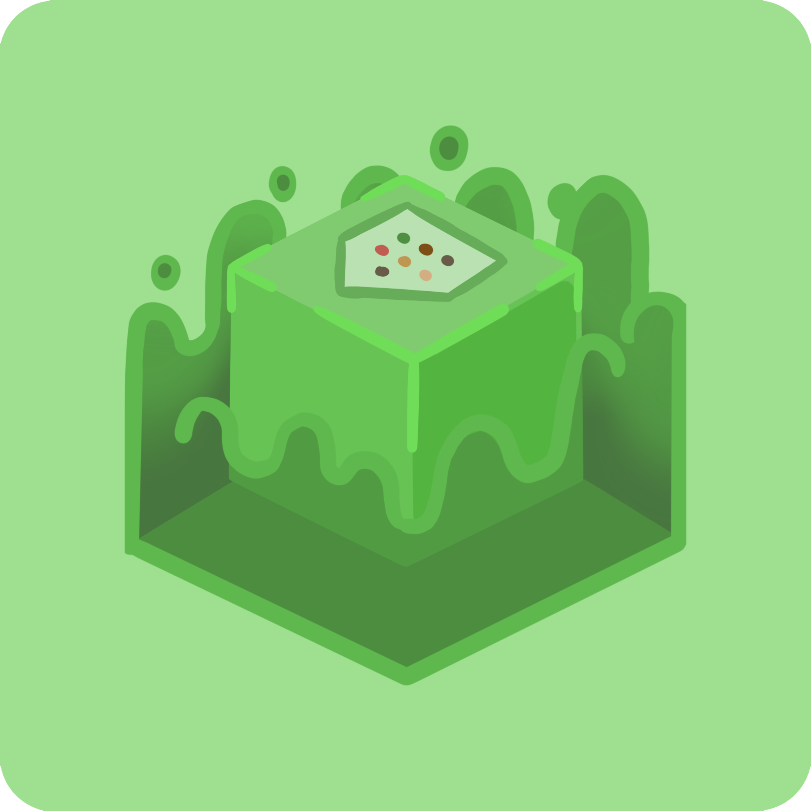

MobileGlues
====

> [!NOTE]
> 
> The latest version:
> 
> **1.0.0**
>
> See [Releases](https://github.com/Swung0x48/MobileGlues-release/releases)

> [!NOTE]
> 
> See [CompatibleShaders.md](https://github.com/Swung0x48/MobileGlues-release/blob/main/CompatibleShaders.md) to see compatible Minecraft shaders.

**MobileGlues**, which stands for "(on) Mobile, GL uses ES", is a GL implementation running on top of host OpenGL ES 3.2, with running Minecraft Java Edition in mind.

Features
====

1. Capable of running Minecraft [Sodium](https://github.com/CaffeineMC/sodium) mod;

2. Capable of rendering most minecraft shaders with Minecraft [Iris](https://github.com/IrisShaders/Iris) mod or [Optifine](https://optifine.net/home).

3. Capable of running some Minecraft mods with custom rendering routines, such as [JourneyMap](https://teamjm.github.io/journeymap-docs/latest) and [Create](https://createmod.net).

Copyright
====

Copyright (C) 2025 Swung0x48, BZLZHH, Tungsten. All rights reserved. Logo artwork kindly provided by Aou156.

Third party components
====

**SPIRV-Cross** by **KhronosGroup**: [github](https://github.com/KhronosGroup/SPIRV-Cross)

**glslang** by **KhronosGroup**: [github](https://github.com/KhronosGroup/glslang)

**GlslOptimizerV2** by **aiekick**: [github](https://github.com/aiekick/GlslOptimizerV2)

**cJSON** by **DaveGamble**: [github](https://github.com/DaveGamble/cJSON)

**Gson** by **Google**: [github](https://github.com/google/gson)  

**AndroidX Activity Compose** by **Android Open Source Project (AOSP)**: [Android Developers](https://developer.android.com/jetpack/androidx/releases/activity)
